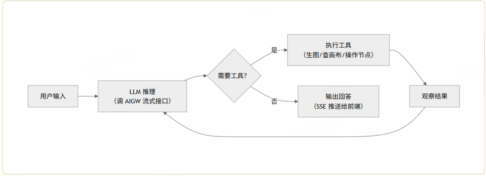

# 汇报分享PPT内容

# 项目整体介绍


**我先从部署拓扑讲起，因为这个系统比较特殊——它运行在三个不同的物理位置上。**

第一个位置是**用户桌面上的 Electron 客户端**，这是前端 UI，用户在这上面操作画布、输入对话。

第二个位置也在**用户的电脑上**，但它是一个独立的后端进程——Python 写的 dm\-monet\-agent 服务。它和 Electron 客户端打包在一起，启动 Electron 时自动拉起。这个服务负责运行 AI Agent 的核心逻辑：DeepAgents 框架（基于 LangGraph 构建的状态机）、LLM 调用编排、上下文管理，以及通过 SSE 向 Electron 推送实时事件。

第三个位置是**网易内网的云端服务器**，跑的是 Go 写的 dreammaker\-scheduler 微服务集群——app\-gateway 做任务入口和参数校验，worker\-scheduler 做任务分配，Worker 集群负责实际调用外部 AI 供应商（比如 Stable Diffusion、DALL\-E、混元等）完成图片、视频、3D 模型的生成。

这三者之间的通信方式不一样。Electron 和本地 Python 服务之间通过**SSE 长连接**做实时推送——因为 LLM 是逐 Token 输出的，需要流式通道。本地 Python 服务向"云端"发起的请求其实分**两条链路**：一条是调 **AIGW（LLM 网关）**做 Agent 推理，用的是 OpenAI 兼容的流式接口（`stream: true`），AIGW 返回的也是 SSE token 流，所以 LLM 链路是**全链路流式**的——token 从 AIGW 流到本地服务、再流到前端；另一条是调 **DM Scheduler** 做图片/视频/3D 的生成任务，用的是标准 **HTTP REST**——POST 提交任务、GET 轮询状态——因为生成任务本身是异步批处理，耗时几秒到几分钟，供应商 API 不产生中间流式输出，轮询是最稳定的方式。


# 模块一：Electron前端介绍

## **UI 形态**

前端是一个 **Electron 桌面应用**（React \+ TypeScript），核心界面由两部分组成：

- **画布区域**（基于 React Flow）：用户在画布上创建各类节点（图像、视频、3D、音频、文本等），节点之间可以连线表示引用关系——比如一个 3D 生成节点连出一条线到格式转换节点，表示"用前一个节点的输出作为输入"。

- **Agent 聊天面板**（侧边栏）：用户在这里和 AI Agent 对话，Agent 可以理解画布上下文、调用工具、在画布上创建或修改节点。


## **用户操作流程**

用户有两种操作方式：

1. **直接操作画布**：手动创建节点、填写生成参数（如提示词、模型选择）、点击"生成"按钮。这条路径不经过 Agent，前端直接调后端 API 提交生成任务。

2. **通过 Agent 对话**：在聊天面板输入自然语言指令（如"帮我生成一张赛博朋克风格的图"），Agent 理解意图后自动调用工具、创建节点、提交生成任务。这条路径走 SSE 流式协议。


## **画布数据存储在哪里**

一个容易误解的点：**画布数据（节点、连线、历史版本）不存在用户本地，而是存在云端的画布后端服务**（`dm-tapnow-backend`，部署在网易内网）。前端操作画布（增删改节点）直接调画布后端 API 写入云端数据库；本地 Agent 需要感知画布时，也通过 HTTP GET 向同一个画布后端拉取数据。


本地 Agent 服务上**不存任何画布数据**。它是纯计算节点——跑 Agent 逻辑、调 LLM、推 SSE 事件。本地唯一持久化的数据是 SQLite 里的 LangGraph checkpoint（对话历史状态）。这也是为什么模块二中 Agent 读画布要用 ContextVar 做请求内缓存——每次都要走网络到云端拉取，缓存起来避免同一个 `/chat` 内重复 HTTP。

Agent 在画布上创建节点后，会推 `canvas.render` 事件让前端全量刷新——因为 Agent 是通过 HTTP 调画布后端 API 创建节点的（写到云端数据库），前端需要重新从云端拉最新数据才能看到 Agent 的操作结果。


## 前端与后端的通信

前端有**两套独立的 API 客户端**，分别对应本地 Agent 和云端服务：

**Agent 对话的 SSE 流程**（这是后端最需要理解的部分）：

1. 用户输入消息 → 前端用 `fetch()`（不是浏览器原生 `EventSource`）发起 `POST /chat`，请求体包含 session\_id、canvas\_id、消息内容。

2. 后端返回 `text/event-stream` 响应，前端通过 `ReadableStream` 逐帧解析 SSE 事件。

3. 事件类型与前端行为的对应关系：

    - `block.created`（type=text）→ 在聊天面板创建新的文本气泡

    - `block.delta` → 增量追加文本到气泡（打字机效果），或追加工具调用的参数

    - `block.updated` → 更新工具调用状态（生成中→已完成），或推送生成任务的进度/结果

    - `interaction.request` → 弹出 HITL 审批卡片（确认/批量确认/选择），用户决策后前端调 `POST /chat/{session_id}/resume`，原始 SSE 流继续推送后续事件

    - `canvas.render` → 触发画布刷新（Agent 在画布上创建了新节点）

    - `stream.done` / `stream.error` / `stream.cancelled` → 流结束，前端做收尾处理


SSE 是半双工协议——服务端推、客户端收。前端想给后端发消息，走的是**独立的 HTTP 请求**，不是通过 SSE 回传：

整个对话的通信模型是：前端发起 `POST /chat`，后端返回一条 SSE 长连接持续推事件；中间如果需要 HITL 审批，前端通过另一个 `POST /chat/{session_id}/resume` 告诉后端用户的决策


我们的前端是一个 Electron 桌面应用，界面分两块：画布区域和 Agent 聊天面板。

画布区域类似一个无限白板，用户在上面创建各种类型的节点——图像生成、视频生成、3D 模型、音频、文本等等。节点之间可以连线，表示引用关系。比如用户先生成一张图，然后从这个图像节点拉一条线到视频生成节点，意思是"用这张图作为输入去生成视频"。每种节点有自己的参数面板，用户填好提示词、选好模型，点生成就会提交到云端执行。

右侧是 Agent 聊天面板，用户可以用自然语言和 AI Agent 对话。Agent 能感知画布上当前有什么节点、选中了什么，然后自动调用工具来操作画布——比如用户说"帮我生成一张赛博朋克风格的图"，Agent 会自己创建图像生成节点、填好参数、提交任务，用户在聊天面板里能实时看到 Agent 的思考过程和工具调用结果。

所以用户有两种操作路径：**手动操作画布**（直接创建节点、填参数、点生成）和**通过 Agent 对话**（自然语言驱动，Agent 自动操作画布）。后者走的就是 SSE 流式协议。


过渡：前端发出的 `POST /chat` 请求到达本地 Python 服务后，由 dm\-monet\-agent 的 Agent 引擎接管——下面介绍这个引擎的内部结构。


# 模块二：dm\-monet\-agent 本地服务

它是 Agent 的大脑，负责理解用户意图、编排工具调用、管理上下文、推送流式事件。前端发来的 `POST /chat` 请求，就由这个模块全权处理。


## Agent 引擎：DeepAgents \+ LangGraph

Agent 的核心循环基于 **ReAct 模式**（Reasoning \+ Acting）：LLM 推理 → 决定是否调工具 → 执行工具 → 观察结果 → 继续推理。这个循环由 **DeepAgents 框架**（内部封装，基于 LangGraph 构建）驱动，底层是 LangGraph 的 `StateGraph` 状态机——LLM 节点和 Tool 节点是两个状态，条件路由根据 LLM 输出决定走哪条边。





- **LLM 调用**：通过 `ChatAIGW`（继承自 LangChain 的 `ChatOpenAI`）调 AIGW 网关，默认 `streaming=True`，token 逐个流回。

- **状态持久化**：用 LangGraph 的 `AsyncSqliteSaver`（异步版 Checkpointer）做对话状态持久化，存本地 SQLite。用异步版是因为整个服务基于 FastAPI + asyncio 单线程事件循环，同步版会阻塞事件循环；选 SQLite 是因为 Agent 跑在用户本机、单用户场景，不需要分布式存储。

- **递归限制**：`recursion_limit=9999`（实质上不限制递归深度），因为 Agent 本身有 HITL 审批和 token 预算两道安全阀，不依赖递归深度来防循环。这里设为 9999 是为了覆盖 LangGraph `astream_events` 默认注入的 25 次限制。


## 事件循环、协程与 ContextVar

理解 dm\-monet\-agent 的运行模型，需要先搞清楚三件事：事件循环怎么调度、为什么不能阻塞、画布数据怎么在深层调用链中传递。

### 事件循环与协程

服务用 **FastAPI \+ uvicorn** 运行，底层是一个 **asyncio 单线程事件循环**。整个服务只有一个线程、一个事件循环，所有请求都是这个循环里的协程。

虽然是单用户本地服务，但用户可以在同一个画布下开多个聊天会话。如果会话 A 的 Agent 还在流式回复中，用户切到会话 B 又发了一条消息——事件循环里就同时跑着两个 `/chat` 协程。不过同一个 session 不会并发，代码入口第一步就是 `await _cancel_existing_chat(session_id)`，先取消同 session 未完成的 chat。

一次 `/chat` 请求的协程调用链：

```Plain Text
chat()                                          ← 整个请求是一个协程
  ├─ await _cancel_existing_chat(session_id)    ← 取消同 session 旧请求
  ├─ await _prime_canvas_context(canvas_id)     ← 异步 HTTP 拉画布详情
  │     └─ await canvas_client.get_canvas_detail()  ← httpx.AsyncClient 发 HTTP GET
  ├─ create_model / create_agent                ← 同步，创建 Python 对象，不涉及 I/O
  └─ return StreamingResponse(inner_stream)     ← 返回后 uvicorn 驱动 inner_stream
       └─ async for event in agent.astream_events():  ← Agent 主循环
            ├─ await ChatAIGW._astream()              ← 等 AIGW 返回下一个 token
            ├─ await tool.invoke()                     ← 执行工具（可能包含 HTTP 调用）
            └─ yield SSE frame                         ← 产出一帧给前端
```

每个 `await` 是一个**协程挂起点**——当前协程暂停，把控制权还给事件循环。事件循环检查有没有其他协程的 I/O 就绪了，有就切过去执行。比如会话 A 在 `await ChatAIGW._astream()` 等 AIGW 返回下一个 token 时，事件循环发现会话 B 的画布 HTTP 响应到了，就切去跑 B 的后续逻辑。等 A 的 token 到了再切回来。这不是并行（同一时刻只有一个协程在跑），但因为大部分时间花在等 I/O，协程切换让 CPU 不闲着，宏观上看起来像并发。


### 为什么不能阻塞

单线程事件循环的致命问题：**任何同步阻塞调用都会冻住整个服务**。

```Plain Text
# ❌ 阻塞写法 — 事件循环停转，所有请求卡住，SSE 流中断
import time, requests
time.sleep(5)
resp = requests.get("https://api.example.com")

# ✅ 异步写法 — 只挂起当前协程，事件循环继续调度其他协程
import asyncio, httpx
await asyncio.sleep(5)
async with httpx.AsyncClient() as client:
    resp = await client.get("https://api.example.com")
```

所以 dm\-monet\-agent 的所有 I/O 都用异步版本：HTTP 请求用 `httpx.AsyncClient`（不用 `requests`）、等待延迟用 `asyncio.sleep`（不用 `time.sleep`）、LLM 调用用 `_astream` / `ainvoke`（async 方法）。


### ContextVar：协程局部变量

ContextVar 是 Python 标准库 `contextvars` 提供的**协程局部变量**。变量定义在模块级（看起来像全局变量），但值的存储是 per\-Task 的——每个 asyncio Task 有自己独立的一份，互不干扰。

底层机制：每个 asyncio Task 内部挂着一个 `Context` 对象（类似一个字典）。`set()` 写入当前 Task 的 Context，`get()` 从当前 Task 的 Context 读取。Task 创建时从父级拷贝一份 Context 快照，之后各写各的。

```Plain Text
# 全局变量 — 所有协程共享，await 切走后可能被别的协程覆盖  ❌
canvas_text = None

# ContextVar — 每个协程 Task 各有一份，await 切走也不会被覆盖  ✅
_canvas_text: ContextVar[str | None] = ContextVar("canvas_text", default=None)
```

dm\-monet\-agent 定义了两个画布相关的 ContextVar（`canvas/context.py`）：

- `_canvas_overview_text`：渲染好的画布概览 Markdown 文本，供每次 LLM 调用时注入

- `_canvas_detail`：画布详情原始 dict，供 `canvas_subgraph` 工具复用

**为什么需要 ContextVar？** `/chat` 的调用链很深：`routes.py` → `DeepAgentStreamAdapter` → `agent.astream_events()` → LangGraph 状态机 → `CanvasAwareChatAIGW._astream()` → `inject_canvas_overview()`。画布数据需要在最深层的 `inject_canvas_overview()` 使用，但中间隔着 LangGraph 框架代码——改不了框架的函数签名，没法把画布数据当参数传下去。

ContextVar 的做法：入口写入，深层直接读取，不改中间任何一层的函数签名

```JavaScript
/chat 入口（routes.py:289）
    │
    ├─ await _prime_canvas_context(canvas_id)
    │     ├─ await canvas_client.get_canvas_detail()    ← HTTP GET 拉画布，只拉一次
    │     ├─ set_canvas_detail(detail)                   ← 写入 ContextVar
    │     └─ set_canvas_overview_text(overview)           ← 写入 ContextVar
    │
    └─ Agent 运行（多轮 LLM + 工具调用）
          │
          ├─ 第 1 次 LLM 调用
          │     └─ inject_canvas_overview()
          │           └─ get_canvas_overview_text()       ← 从 ContextVar 读，不发 HTTP
          │
          ├─ 工具调用: canvas_subgraph
          │     └─ get_canvas_detail()                    ← 从 ContextVar 读，复用入口数据
          │
          └─ 第 2 次 LLM 调用
                └─ inject_canvas_overview()
                      └─ get_canvas_overview_text()       ← 同一请求内始终读同一份缓存
```

ContextVar 的核心价值：**免传参**（深层代码直接 `get()`，不用改 LangGraph 框架的函数签名）和**请求内缓存**（入口拉一次画布数据，同一个 `/chat` 请求内多次 LLM 调用和工具调用复用，避免重复 HTTP）。


## Message / Block 双层数据模型

Agent 一次回复里可能同时包含文本、思考过程、工具调用、图片、文件、画布节点引用——如果只用一个扁平的 message 字符串来承载，前端解析和渲染会非常痛苦。所以设计了 **Message 和 Block 两层结构**：

- **Message**：Agent 一轮回复的容器，拥有 `id`、`role`（user/assistant）、`status` 等元数据，以及一个 `blocks` 数组。

- **Block**：Message 中的一个内容片段，每个 Block 有独立的 `block_id` 和 `type`。

目前支持**七种 Block 类型**（TextBlock、ThinkingBlock、ToolUseBlock、ImageBlock、FileBlock、NodeBlock、SkillBlock）：

每种 Block 的渲染组件是独立的，互不干扰。前端按 `type` 字段做差异化渲染。

**SSE 事件与 Block 生命周期的对应关系**：

1. `block.created`：携带 `block_id` 和 `type`，前端据此创建一个空的 Block 容器。

2. `block.delta`：携带 `block_id` 和增量内容（文本 delta 或工具参数 delta），前端追加到对应 Block 里——TextBlock 表现为打字机效果，ToolUseBlock 表现为参数逐步填充。

3. `block.updated`：携带 `block_id` 和更新后的完整状态——比如 ToolUseBlock 从 `status=generating` 变为 `status=running`（开始执行）再变为 `status=completed`（结果内嵌在 `tool.result` 中）。

一个 Message 中可能有多个 Block 交替推送——比如先是一段 TextBlock（Agent 说"好的，我来帮你生成"），然后一个 ToolUseBlock（调用 generate\_image 工具），工具返回后又是一段 TextBlock（Agent 说"图片已生成"）。整个过程在同一条 SSE 流中交织推送。


## SSE 事件翻译：DeepAgentStreamAdapter

LangGraph的**`astream_events()`**** 不是凭空产生事件的**——它是一个观察者，包裹住状态机的整个执行过程。当 LLM 节点在流式 yield token 时，它拦截到每个 yield，包装成 `on_chat_model_stream` 事件；当状态机路由到工具节点、工具开始/结束执行时，同样拦截并包装成 `on_tool_start` / `on_tool_end`。token 的真正源头是 AIGW 返回的 SSE 流，经过上面的每一层一路 yield 下来——每层都是 async iterator，没有任何地方攒批或阻塞，这就是 LLM 链路能做到全链路流式的根本原因。


LangGraph 内部产生的事件（`on_chat_model_stream`、`on_tool_start`、`on_tool_end` 等）是框架私有的，前端无法直接消费。**DeepAgentStreamAdapter** 的职责就是把这些内部事件翻译成前端约定的 SSE 协议：

这层翻译的价值在于**框架解耦**：如果未来换掉 LangGraph（比如换成 AutoGen 或 CrewAI），只需要写一个新的 StreamAdapter 实现事件映射，前端协议不用改。


## 分层上下文感知

Agent 不是一个"纯聊天机器人"——它需要知道画布上现在有什么。上下文注入分三层：

1. **画布概览（入口层）**：每次 `/chat` 请求进来时，调 `_prime_canvas_context(canvas_id)` 向画布后端拉取画布详情，按节点规模分 5 级渐进渲染成 Markdown 摘要（≤5 节点时输出全量详情含 id/type/label/position/output 和所有边；6\-30 节点输出 id/type/label + 边；31\-100 节点最多展示 60 个节点并附类型分布；>100 节点仅输出总数和类型分布），通过 `ContextVar` 缓存在请求作用域内。后续每次 LLM 调用前，通过 `CanvasAwareChatAIGW`（继承 `ChatAIGW`，重写 `_astream` / `_agenerate`）调用 `inject_canvas_overview()` 注入到最新一条 HumanMessage 前面——这样 LLM 能"看到"画布全貌，但不会把全量节点信息塞满上下文。

2. **按需查询（工具检索层）**：Agent 可以通过 `canvas_node_detail` 和 `canvas_subgraph` 两个工具按需查询某个节点的详细信息或子图拓扑——只有 Agent 判断需要时才调用，避免无关信息占用 token。

3. **上下文溢出自动压缩**：当上游 LLM 返回上下文超长错误时，`ChatAIGW` 将其转为 `ContextOverflowError`；DeepAgent 框架的 `SummarizationMiddleware` 自动压缩历史并重试；SSE 层过滤压缩过程输出，用户无感知。该机制是**被动触发**，不是主动 Token 预检。


## HITL 人机审批

Agent 调用工具时，需要判断这个操作是否需要用户确认。权限配置分**两层**：

**第一层：工具级静态配置**。在 Agent 工厂（`factory.py`）中，通过一个静态字典定义哪些操作需要 interrupt 审批：

```Plain Text
PERMISSION_INTERRUPT_ON_TOOLS = {
    "execute": True,      # 执行 shell 命令
    "write_file": True,   # 写文件
    "edit_file": True,     # 编辑文件
}
```

不在字典里的工具（如 `query_models`、`canvas_node_detail`、`generate_and_create_node`）默认不需要审批，直接执行。这个字典在创建 Agent 时传给 DeepAgents 框架的 `interrupt_on` 参数。

**第二层：请求级权限模式**。前端发 `/chat` 时带 `permission_mode` 参数：

- `ASK` 模式 → 使用上面的字典，写操作需要审批。

- `FULL_ACCESS` 模式 → 传 `None`，所有操作都自动放行，不触发任何 interrupt。

当工具命中 `interrupt_on` 配置时，完整的中断\-恢复流程如下：

**第一步：中断（interrupt）**

DeepAgents 框架在工具节点执行前调用 `interrupt()`，LangGraph 抛出 `GraphInterrupt` 异常中断状态机循环——注意这不是线程挂起，而是异常驱动的控制流。中断时 LangGraph 自动把当前 state（对话历史、工具调用参数、节点执行位置等）通过 Checkpointer 持久化到 SQLite。

**第二步：推送审批事件**

中断后，DeepAgentStreamAdapter 进入一个 `while True` 循环：先调 `aget_state(config)` 从 Checkpointer 读取 state snapshot，检查是否有 pending interrupts。有则调 `_build_interaction_frame(interrupt)` 构造 `interaction.request` SSE 事件推给前端，事件内容包括：

- 操作名称（如 `write_file`）

- 操作参数（如文件路径、内容）

- 操作描述

- 可选项：`["approve", "reject"]`

- 如果是批量操作（多个工具调用），会合并成一个 batch 审批

**第三步：等待用户决策**

推完审批事件后，代码调 `register_interrupt(session_id)` 创建一个 `asyncio.Event`，然后 `await asyncio.wait_for(event.wait(), timeout=300)` 挂起当前协程等待——**SSE 连接不断开**，前端仍然保持着这条长连接。超时 300 秒未决策则自动失败。

**第四步：恢复（resume）**

用户在前端审批卡片上选择 approve 或 reject → 前端调 `POST /chat/{session_id}/resume` → 后端 `resolve_interrupt()` 把 decision 存入内存并 `event.set()` 唤醒等待中的协程 → 代码用 `Command(resume=matched_decision)` 调 `astream_events()` 恢复状态机。

恢复时 LangGraph 框架从 Checkpointer 读取之前持久化的 state，找到中断时的节点位置，**重新执行该节点函数**。此时 `interrupt()` 不再抛异常（因为已经有了 resume value），节点继续往下执行工具逻辑。这要求 **`interrupt()`**** 之前的代码必须是幂等的**——因为重新执行时会再跑一遍。

如果用户 approve → 工具正常执行，结果通过 SSE 推给前端。如果 reject → 工具跳过，Agent 收到拒绝信息后可能换一种方式继续对话。恢复后可能又触发新的 interrupt（比如 Agent 接着又要调另一个写操作），所以外层是 `while True` 循环，直到 graph 正常完成（无 pending interrupt）才退出。


## 任务提交与轮询

当 Agent 决定执行一个 AI 生成任务（比如调用 `generate_image` 工具），本地服务通过 `DmProvider` 向云端提交任务：

1. **提交**：`POST /api/v1/apps/{app}/run`，携带生成参数（提示词、模型选择等），云端返回 `task_id`。

2. **轮询**：`InvocationRuntime._poll_until_complete()` 以固定间隔（图像 5s、3D 10s、视频 30s）循环调 `GET /api/v1/apps/{app}/status`，每次返回一次性 JSON 快照（status、progress、error）。轮询在后台默默进行，**中间进度不会推送给前端**——前端在此期间看到的是工具调用卡片的"执行中"状态。

3. **获取结果**：任务成功后调 `fetch()` 拿最终结果（图片 URL、视频 URL 等）。结果作为工具返回值，被 LangGraph 捕获为 `on_tool_end` 事件，DeepAgentStreamAdapter 翻译成 `block.updated`（status=completed）推给前端——前端此时才看到生成完成的结果。

注意：这里的轮询对象是**云端 DM Scheduler**（模块三），不是 AIGW。AIGW 只负责 LLM 推理的流式调用，不负责生成任务。


# 模块三：云端 dreammaker\-scheduler 微服务

本地 Agent 服务提交的生成任务到达云端后，由 Go 写的 dreammaker\-scheduler 微服务集群接管。这个集群负责任务的入队、调度、执行和结果回写，是整个平台的"算力中枢"。


## 四个核心组件


## 一个任务从入队到完成的完整链路

本地 Agent 通过 `POST /api/v1/apps/{app}/run` 将任务提交到 app\-gateway，gateway 做完参数校验和鉴权后，将任务以 `ZADD` 写入 Redis ZSet 优先级队列（score 为毫秒时间戳），同时在 MongoDB 写入一条 `status=queued` 的任务记录，然后返回 `task_id`。worker\-scheduler 持续消费队列——用 `ZRange` 批量取候选、`ZREM` 原子抢占，按加权轮询选择优先级并检查用户并发限制后，将任务分配给空闲的 Worker。worker\-sidecar 收到任务后，经 AIGW 供应商网关调用外部 AI 供应商执行生成（期间会做指数退避重试和 fallback 切换），拿到结果后通过 HTTP Report 上报给 worker\-scheduler，由 scheduler 的 action 层回写 MongoDB（`status=success` \+ 结果数据）并异步推送到 Kafka 供下游消费。本地 Agent 在此期间以固定间隔（图像 5s、视频 30s）轮询 `GET /api/v1/apps/{app}/status`，gateway 从 MongoDB 查询状态返回 JSON 快照，直到 Agent 拿到 `status: success` 和最终结果。


## 优先级队列调度

**队列隔离**：不同优先级对应不同的 Redis key，队列按 key 隔离。key 格式在 `priority>0` 时为 `apps_pending_task::{priority}::{source}::{taskMode}::{cluster}::{env}`（6 段），`priority=0`（默认队列）时为 `apps_pending_task::{source}::{taskMode}::{cluster}::{env}`（5 段，无 priority 字段，兼容旧格式）。score 是毫秒时间戳（同优先级内先进先出）。

**加权轮询解决饥饿问题**：纯优先级调度有经典问题——"高优先级队列非空就不看低优先级"，高负载时低优先级任务会完全饿死。我们的做法是加权轮询：为每个优先级维护一个配额计数器（counter），初始值等于配置的 weight。每次调度时 `pickPriority` 按 priority **降序遍历**，找到第一个 counter \> 0 的优先级，返回它并把 counter 减 1。当所有 counter 都归零时全部重置回初始 weight，开始新一轮。举例：配置 `[{priority:5, weight:5}, {priority:0, weight:3}]`，一轮 8 次调度中前 5 次选 priority=5、后 3 次选 priority=0——高优先级在同一轮内优先被消费，但低优先级按配额比例保证不会饿死。

**降序兜底**：加权轮询选出的优先级队列可能恰好为空（没有该优先级的任务）或候选全被其他 Pod 抢走了。此时 `Consume` 函数会 fallback 到**降序遍历所有优先级队列**——从最高优先级到最低逐个 `tryConsume`，哪个队列先拿到任务就返回，确保这次消费循环不会空跑。所以完整的消费流程是：**加权选队列 → 尝试消费 → 失败则降序扫全部队列兜底**。

**无锁乐观抢占**（tryConsume \+ grabJob）：

1. **批量候选拉取**：消费者调用 `ZRange(key, 0, 255)`，一次取出该优先级队列中最多 256 个候选（按 score 排序，最早的在前）。

2. **遍历 \+ 用户并发检查**：对每个 member（格式 `user::taskID`），检查该 user 是否已有任务在运行。有并发冲突的暂存到 `queueJob` 列表跳过。

3. **竞争删除（grabJob）**：对无冲突的 member 执行 `ZREM key member`。由于 Redis 单线程，只有一个 `ZREM` 返回 ≥ 1（删除成功），其他返回 0。返回 ≥ 1 的消费者获得任务所有权 → 从 MongoDB 加载完整数据 → 注册 etcd → 执行。返回 0 的消费者继续遍历列表中下一个候选（不需要重新 ZRange）。

4. **二轮兜底**：第一轮遍历完后，对 `queueJob` 中跳过的 member 再做一轮 grabJob。

> **为什么没有用 Lua 脚本合并 ZRange \+ ZREM？**
> 确实可以把 ZRange 和 ZREM 封装成 Lua 脚本原子执行来消除竞态窗口，但实际没这样做，原因有三：① ZRange 拿到候选后还要检查用户并发（查 Go 进程内存中的 `concurrentManager`），这些业务判断无法在 Redis Lua 里完成；② 批量拉 256 个候选 \+ 逐个尝试的模式足够高效，前几个被抢了后面还有大量候选，不需要反复网络往返；③ DM 的任务量级是每秒几十到几百，多 Scheduler 实例并发扫同一队列的频率不高，空竞争率实测很低。
> 
> **为什么不用分布式锁？**
> 分布式锁（如 RedLock）引入额外的锁竞争、超时、续租等复杂性。而 `ZREM` 天然具有"谁删成功谁拥有"的语义，本质上是一种乐观并发控制——先做操作，通过返回值判断是否成功，失败则继续下一个候选。比悲观锁性能更好、实现更简单。
> 
> 


**etcd Watch \+ 内存原子计数器做用户并发管控**：

每个用户同时能跑的任务数需要限制，防止一个用户占满集群算力。实现方式是 `ConcurrentManager`——一个纯内存的原子计数器，维护两个 map：`taskMap`（按 `source::taskMode::cluster` 维度计数）和 `userMap`（再加上 user 维度）。计数器由 etcd Watch 驱动：任务注册到 etcd（key `/task/{env}/{taskID}`）时 Watch 收到 PUT 事件 \+1；任务完成或 Worker 崩溃导致 key 删除时 Watch 收到 DELETE 事件 \-1。消费时的并发检查：在 tryConsume 遍历候选任务时，对每个 member 调 `concurrentManager.GetUser()`，如果返回值 ≥ 1（该用户已有任务在运行），就暂时跳过放入 `queueJob` 列表。

**原子计数器的线程安全**：`ConcurrentManager` 使用 `go.uber.org/atomic` 的 Int64，底层是 Go `sync/atomic` 包。关键的增减操作是一个 CAS 循环——先 Load 当前值，计算 next = curr \+ delta（负数结果钳位到 0），调 `CompareAndSwap(curr, next)`，CAS 失败说明有其他 goroutine 修改了值，重新循环。

**多 Pod 一致性**：每个 worker\-scheduler Pod 都有自己独立的 `ConcurrentManager`。多 Pod 之间靠 etcd Watch 同步——所有 Pod 都 Watch 同一个 `/task/{env}/` 前缀，一个 Pod 注册了任务（写 etcd），其他 Pod 都收到 PUT 事件各自 \+1。最终每个 Pod 的计数器基本一致——etcd Watch 有毫秒级延迟，极端情况下可能短暂超过并发限制，但对"限制并发"场景够用。


## Worker 注册发现与心跳

在我们的调度平台里，worker\-scheduler 启动时调用 etcd Grant 创建一个 TTL=7200s（2小时）的 Lease（用于任务注册），然后每 5 分钟重新 Grant 一次刷新 Lease；另外 api\-kube 服务也有一套独立的 etcd Lease（TTL=3600s，用于 Worker Pod 注册，无续期循环）。Worker\-sidecar 启动时通过 HTTP 调用 worker\-scheduler 的 Report 接口注册自己，worker\-scheduler 收到后将 Worker 信息 Put 到 etcd（如 `/worker/{env}/{name}`），绑定当前 Lease；之后 sidecar 每 30s 发一次 HTTP 心跳，worker\-scheduler 收到后 re\-PUT 该 Worker 的 key，保持信息新鲜。

如果 Worker 宕机或网络断连，心跳停止。worker\-scheduler 侧通过心跳超时判断 Worker 不可用，不再为其 re\-PUT key。当 Lease 最终过期时，etcd 自动删除绑定在该 Lease 上的所有 Worker key。worker\-scheduler 自身通过 Watch 机制监听 `/worker/` 前缀，收到 DELETE 事件后执行三个清理动作：将该 Worker 从内存调度缓存中移除（`workerCache.Delete`）、从任务路由表中清理（`cacheKeyManager.WorkerDelete`，按类型/集群的索引）、递减对应集群的 Worker 计数器（`workerClusterMap.Decr`）——这样后续任务就不会再分配给已下线的节点。


## 弹性扩缩容

DM 的任务分两类：调供应商 API 的任务（如 Kling、Runway）只需要 HTTP 调外部接口，跑在 CPU Worker 上；开源部署的任务（如 ComfyUI、SD）需要本地 GPU 推理，跑在 GPU Worker 上。CPU Worker 相对廉价，用 K8s HPA 按 CPU/内存水位扩缩就够了。但 GPU Worker 不行——GPU 满载推理时 CPU 可能很闲，HPA 看 CPU 5% 会觉得"资源充足"甚至触发缩容，这完全是误判。所以我们针对 GPU Worker 自定义了 Autoscaler。

自定义 Autoscaler 的核心指标是**任务队列积压深度**（GPU Worker 类型如 ComfyUI、SD 从 MongoDB 查 status=queued 的记录数）。每 30 秒检查一次，扩容条件是 Worker 数 ≤ 队列长度的一半**且**有已 terminated 的 Pod 可复用（没有可唤醒的 Pod 时即使队列条件满足也不扩容）；缩容条件是 Worker 不在忙且空闲时间超过配置的阈值，同时 Running Worker 数要大于最小副本数下限。扩容的方式比较特别——不是创建新 Pod，而是**唤醒已 terminated 的 Pod**，调 api\-kube 的 UpdateWorker 接口重新激活它；缩容则是调 DeleteWorker 删除空闲 Pod。

有几个细节：第一，扩缩容有**冷却机制**，通过 Redis ZSet 记录操作历史，当前实现是只要存在历史记录就跳过本轮（简化版冷却，未做精确的时间窗口判断），防止指标抖动导致频繁扩缩（thrashing）。第二，缩容时会检查 Worker 是否在忙，只对空闲且超过阈值的 Worker 缩容，实现**优雅下线**。第三，设置了**最小副本数下限**（MinWorker），即使完全空闲也不会缩到零。第四，有**安全检查**——如果有 Worker 处于 pending 或 terminating 状态，本轮直接跳过，防止"还没启动完就又触发扩容"的雪崩式超扩。第五，因为多个 worker\-scheduler 实例同时运行，用**基于 Redis SetNX 的简单互斥锁**（TTL 固定 180s，非 Redlock 语义）保证同一时刻只有一个实例执行扩缩容。


## 容错降级：重试与供应商切换

worker\-sidecar 调用供应商时的容错分**三层**，从内到外依次是：

**第一层：****`executeWithRetry`****——同一供应商内的快速重试**

代码在 `api/external/aigw/openai.go`，是一个同步的 for 循环，最多 3 次尝试（含首次调用），指数退避 1s→2s（第三次即最后一次失败后不再 sleep，直接返回错误）。匹配的错误类型是网络超时、连接拒绝、TCP 读写错误等网络层故障，以及 HTTP 502\+ 且响应体含超时特征（`dial tcp` + `timeout`）的网关错误——不是所有 502\+ 都重试，只有 body 里带超时特征的才算暂时性故障。HTTP 429 限流**不在这里处理**。

**第二层：queue\-retry——针对 429 限流的长退避轮询**

专门针对 PT 模型（如 `gemini-3-pro-image-pt-art1-openai`、`gemini-3-pro-image-pt-art3-openai`）等白名单内的模型。当供应商返回 429 时，不是立即失败，而是进入一个更长的退避轮询循环。参数从配置文件读取，默认值为：初始退避 3s、最大退避 60s、倍数 2\.0、抖动因子 ±20%、最大等待时间默认 12 小时。退避阶梯是 3s→6s→12s→24s→48s→60s（cap）。抖动的计算方式是 `基础退避 ± (基础退避 × jitter)`，即双向随机偏移，避免多个任务在同一时刻重试造成惊群效应。如果 queue\-retry 最终超时仍未恢复，错误会被标记为可重试类型，从而触发外层的 Fallback chain。

**第三层：Fallback chain——供应商之间的切换**

代码在 `worker-sidecar/pkg/fallback/executor.go`。当主供应商的内层重试全部耗尽后，如果错误是可重试类型，`fallback.Run` 按链路顺序对每个供应商尝试一次 `spec.Call()`，失败且符合 fallback 条件则切到下一个。链路是线性的：主供应商 → 备用 1 → 备用 2 → \.\.\.，直到某一个成功或全部耗尽。注意 fallback executor 本身每步只调用一次，底层重试（`executeWithRetry` 的 3 次网络重试、或 PT 通道的 429 排队重试）由各供应商的调用实现自行决定。

整个过程是**无状态的 per\-request fallback**——不维护熔断器状态，不记录哪个供应商"当前不可用"，每个新请求都从主供应商开始尝试。这意味着主供应商恢复后，下一个请求自然就能成功，不需要额外的"恢复探测"机制。代价是：主供应商持续故障时，每个请求都要先打一次主供应商、等它重试耗尽后才切备用，增加了延迟——但对 AI 生成任务（本身耗时 10s\-几分钟）来说，多等几秒重试的感知不强。

Fallback 规则按**模型粒度**配置在 MongoDB 的 `dreamworker_fallback_rule` 集合中，每条规则包含主模型、备用模型列表、最大 fallback 深度、以及 `skip_on`（某些错误不切换，如内容审核不通过）和 `retry_on`（只在匹配特定错误时才切换）的精细化控制。


> **可优化点：引入熔断器（Circuit Breaker）**
> 当前的无状态 per\-request fallback 有一个代价：主供应商持续故障时，每个请求都要先打一次主供应商、等 3 次重试耗尽后才切备用，白白浪费几秒延迟。如果引入熔断器模式，可以记住"这个供应商最近挂了"：失败次数超过阈值后进入 Open 状态，短期内直接跳过主供应商、立即走备用；一段时间后放一个探测请求试试是否恢复（Half\-Open），成功则恢复正常流量（Closed）。这能显著减少故障期间的用户等待时间。当前没做的原因是实现简单优先，且 AI 任务本身耗时长（10s\-几分钟），多等几秒重试的感知不强——但如果供应商故障频率上升，熔断器会是下一步的优化方向。
> 
> 


## 结果如何回到本地 Agent

worker\-sidecar 执行完任务后，通过 HTTP Report 上报给 worker\-scheduler，由 scheduler 的 action 层将结果（图片 URL、视频 URL 等）和状态（success/failed）**回写 MongoDB**，并异步推送到 Kafka 供下游消费。对本地 Agent 而言，它感知不到这个上报过程——本地 Agent 通过轮询 `GET /api/v1/apps/{app}/status` 查到 `status: success` 后，从响应的 data 字段取出结果。

这意味着从任务完成到本地 Agent 感知到结果，有一个**轮询间隔的延迟**（图像 5s、3D 10s、视频 30s）。但相对于任务本身几秒到几分钟的执行时间，这个延迟可以忽略不计。


